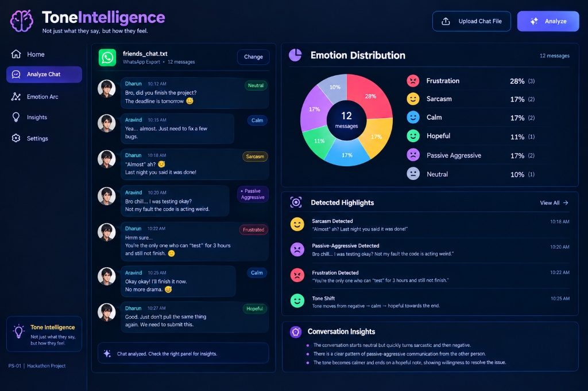

# 🧠 CEREBRO — Neural Sentiment Hackathon
### *Tone Intelligence in Conversations — Not just what they say, but how they feel.*



> **Problem Statement (PS-01):** Build a system that analyzes the emotional arc of a multi-turn conversation and identifies changes in tone throughout the conversation.

---

## 🎯 Executive Summary & Core Philosophy

Traditional sentiment analysis engines naively classify individual messages in isolation:
> *"Fine."* $\rightarrow$ Positive? Neutral?

In human conversation, **a message cannot be understood correctly without conversational context**. The word *"Fine."* following an accusation of missed deadlines is not positive—it is curt, defensive, and passive-aggressive.

**CEREBRO** treats conversation as an **evolving emotional state**. It analyzes multi-turn dialogues (specifically **WhatsApp chat exports**) to compute message-level polarity, evaluate conversational tension, detect significant emotional drift, isolate inciting triggers, and explain **why** the tone shifted.

---

## ✨ Key Features

1. **Robust WhatsApp Chat Parser (`.txt`)**
   - Supports 12-hour (`10:12 am`) and 24-hour (`22:12`) timestamps.
   - Automatically handles multiline continuations, emoji reactions, and group chats.
   - Intelligently filters system notifications (`Messages are end-to-end encrypted`, `joined/left the group`, etc.) and media omission markers.
   - Supports code-switching / colloquial dialect cues (e.g. *bro chill*, *almost ah?*, *seri*).

2. **Multi-Turn Context Engine**
   - Maintains a sliding context window of past turns.
   - Tracks **Emotional Intensity** ($0\text{–}100\%$) and **Conversational Escalation** ($0\text{–}100\%$).
   - Dynamically amplifies or dampens message interpretations based on preceding friction.

3. **Sarcasm & Passive-Aggression Detection**
   - Isolates ironic quotation marks (e.g., *"Almost" ah?*, *"test" for 3 hours*).
   - Identifies tone-policing and blame-deflection (*"Bro chill... not my fault"*).
   - Flags rhetorical particles and disdainful emojis (🙃, 😒, 🙄).

4. **Emotional Drift Engine (Custom Core)**
   - Computes rolling contextual baselines of intensity and sentiment.
   - Calculates statistical divergence:
     $$\Delta_{\text{drift}} = \frac{|\text{intensity} - \text{baseline}_{\text{intensity}}|}{100} \times 0.5 + \frac{|\text{sentiment} - \text{baseline}_{\text{sentiment}}|}{2} \times 0.5$$
   - Detects state transitions: *Negative Escalation*, *Sarcastic Diversion*, *Passive-Aggressive Defensiveness*, and *De-escalation Recovery*.

5. **Trigger Attribution & "Why Did The Tone Change?"**
   - Traces the spark behind every major shift.
   - Renders a before-and-after causality flow:
     $$\text{Before State} \longrightarrow \text{Trigger Statement} \longrightarrow \text{After State} \longrightarrow \text{AI Interpretation}$$

6. **Interactive Conversation Replay**
   - Reveals messages sequentially with animated progression.
   - Graph and intensity pills update live as messages appear.

7. **Pixel-Matched UI & Visualizations**
   - Built to match the reference design: cosmic navy background, glowing brain insignia, round avatars, and clean status badges (`[Neutral]`, `[Calm]`, `[Sarcasm]`, `[• Passive Aggressive]`, `[Frustrated]`, `[Hopeful]`).
   - Chart.js Donut Chart with centered message count.
   - Interactive Emotion Arc Timeline with hover tooltips and tone-shift markers.

8. **Gemini API Integration with Fallback**
   - Contextual reasoning powered by Google Gemini API.
   - Seamless, instant fallback to the local algorithmic NLP engine if offline or no key is provided.

---

## 🛠️ Architecture & Technology Stack

```
Uploaded WhatsApp Export (.txt)
              │
              ▼
   ┌──────────────────────┐
   │ WhatsAppParser       │  --> Strips system msgs, normalizes 12h/24h timestamps
   └──────────┬───────────┘
              │
              ▼
   ┌──────────────────────┐
   │ NLP Pipeline         │  --> Sentiment, Emotion, Sarcasm & Passive-Aggression
   └──────────┬───────────┘
              │
              ▼
   ┌──────────────────────┐
   │ Context & Drift      │  --> Rolling baseline, threshold trigger detection
   └──────────┬───────────┘
              │
              ▼
   ┌──────────────────────┐
   │ Gemini / Heuristic   │  --> Narrative insights & "Why did tone change?"
   └──────────┬───────────┘
              │
              ▼
   ┌──────────────────────┐
   │ Responsive Frontend  │  --> Chat Stream, Donut Chart, Emotion Arc Timeline
   └──────────────────────┘
```

- **Frontend**: Vanilla JavaScript (Modular ES6 architecture), HTML5, CSS3, Chart.js.
- **Backend**: Python 3.14, Flask, Flask-CORS, Pydantic, Scikit-learn, NumPy, Pandas.
- **AI & NLP**: Custom rule-based linguistic cues + Google Gemini API (`google-genai`).

---

## 🚀 Quickstart & Local Installation

### 1. Clone & Setup Environment
```bash
# Clone the repository
git clone https://github.com/your-username/cerebro-tone-intelligence.git
cd "tone analyser"

# Install backend dependencies
pip install -r backend/requirements.txt
```

### 2. Configure Environment Variables (Optional)
```bash
# Copy template
cp backend/.env.example backend/.env

# Add your Gemini API key (optional - local NLP runs without it)
# GEMINI_API_KEY=AIzaSy...
```

### 3. Run the Application
```bash
python backend/app.py
```
Open **[http://127.0.0.1:5000](http://127.0.0.1:5000)** in your browser!

The application auto-loads the synthetic `friends_chat.txt` dataset on startup so you can explore the entire dashboard immediately.

---

## 🧪 Running Unit & Integration Tests

The project includes unit tests for the parser, drift engine, and the end-to-end pipeline:

```bash
# Run all tests
python -m unittest discover -s tests
```

Output:
```
....
Ran 4 tests in 0.004s
OK
```

---

## 🌐 API Reference

### 1. Upload File
`POST /api/upload`
- **Body**: `multipart/form-data` with `file: <chat.txt>`
- **Response**:
```json
{
  "success": true,
  "conversation_id": "a1b2c3d4",
  "filename": "friends_chat.txt",
  "total_messages": 12,
  "participants": ["Aravind", "Dharun"],
  "preview": [...]
}
```

### 2. Analyze Conversation
`POST /api/analyze`
- **Body**:
```json
{
  "conversation_id": "a1b2c3d4",
  "drift_threshold": 0.20
}
```
- **Response**: Full `AnalysisResponse` containing emotion distribution, highlights, timeline arc, and trigger moments.

### 3. Load Synthetic Sample
`GET /api/sample`
- Returns pre-parsed `friends_chat.txt` ready for 1-click test.

### 4. Health Check
`GET /api/health`
```json
{
  "status": "healthy",
  "service": "CEREBRO Tone Intelligence",
  "gemini_configured": false,
  "version": "1.0.0"
}
```

---

## ☁️ Deployment Guide

### Backend on Render
1. Create a **Web Service** on Render pointing to this repository.
2. Build Command: `pip install -r requirements.txt`
3. Start Command: `gunicorn backend.app:create_app()` or `python backend/app.py`
4. Set Environment Variables: `PORT=5000`, `GEMINI_API_KEY=...`

### Frontend on Vercel / Netlify
1. Point root to `frontend/`.
2. In `frontend/js/api.js` or via the in-app **Settings** tab, configure the **Backend API URL** to your Render service (`https://your-service.onrender.com`).
3. CORS is pre-configured on Flask backend to permit any frontend origin.

---

## 🛡️ Responsible AI & Ethical Boundaries

CEREBRO estimates conversational tone and emotional drift based on text semantics and linguistic cues. It adheres strictly to ethical AI guidelines:
- **No psychological diagnosis**: CEREBRO does not diagnose personality disorders or mental health.
- **Probabilistic phrasing**: CEREBRO reports *"Possible Sarcasm Detected"* and confidence scores rather than absolute certainty.
- **Session-Based Privacy**: Uploaded chats are analyzed in-memory during the active session.

---

## 👥 Hackathon Details
- **Project Name:** CEREBRO (Tone Intelligence)
- **Problem Statement:** PS-01 — Tone Intelligence in Conversations
- **Repository:** CEREBRO Hackathon Build
